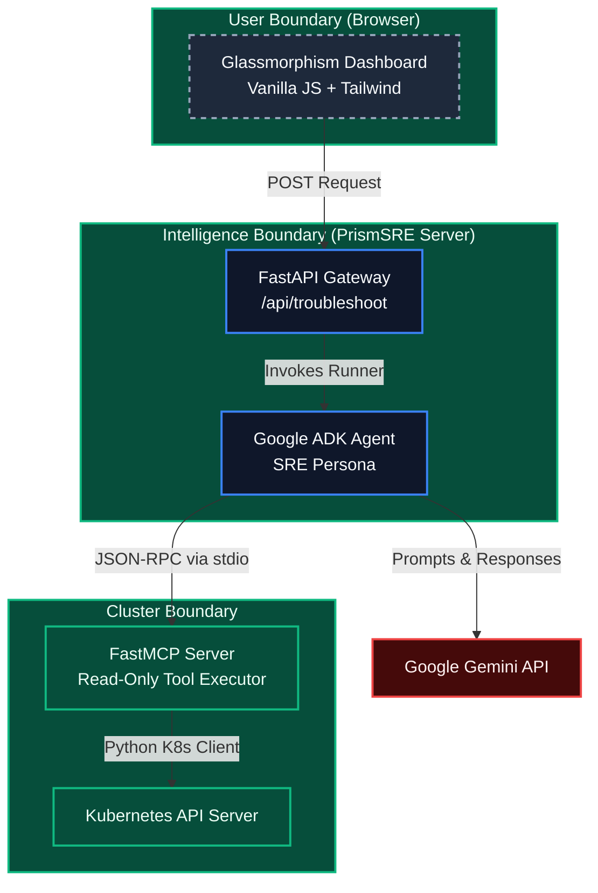

# 🏗️ PrismSRE Architecture

PrismSRE is designed with a strict focus on **security**, **modular decoupling**, and **extensibility**. By separating the AI reasoning logic from the Kubernetes cluster execution context, we prevent severe security risks such as arbitrary code execution or prompt injection.

---

## 🧩 High-Level System Architecture

The system consists of three main boundaries:

1. **The User Boundary (Frontend)**
2. **The Intelligence Boundary (Dashboard & AI Agent)**
3. **The Cluster Boundary (MCP Gateway & K8s)**

---

## 📦 Component Breakdown

### 1. The Glassmorphism Dashboard
- **Tech Stack:** Single-file `index.html` using Tailwind CSS (via CDN), Vanilla JavaScript, `marked.js` for markdown rendering, and `highlight.js` for syntax highlighting.
- **Responsibility:** Captures user queries, renders the UI dynamically, and streams requests to the backend API.

### 2. FastAPI Gateway (`app.py`)
- **Tech Stack:** Python + FastAPI.
- **Responsibility:** Exposes a secure REST API `/api/troubleshoot`. It handles incoming web requests, initializes the ADK Agent session, and serves the static HTML dashboard.

### 3. The SRE AI Agent (`agent.py`)
- **Tech Stack:** Google Agent Development Kit (ADK).
- **Responsibility:** Acts as the brain of the operation. It is instantiated with a robust System Prompt instructing it to behave as an elite Principal SRE. When an issue is reported, the Agent decides which MCP tools to invoke to gather context.

### 4. The MCP Server Gateway (`server.py`)
- **Tech Stack:** Model Context Protocol (FastMCP) + Official Kubernetes Python Client.
- **Responsibility:** This is the most critical security boundary. The MCP server exposes **only specific, read-only tools** to the agent via standard input/output (`stdio`).
- **Available Tools:**
  - `get_pod_status(namespace, pod_name)`
  - `fetch_pod_logs(namespace, pod_name, tail_lines)`
  - `describe_deployment(namespace, deployment_name)`

---

## 🛡️ Security Posture

### Why not just give the LLM bash access?
If an LLM is given direct bash execution privileges in a Kubernetes cluster, a malicious actor could use **Prompt Injection** to force the LLM to run `kubectl delete all --all` or steal secrets.

### The MCP Advantage
By using the **Model Context Protocol (MCP)**, PrismSRE implements a strict **Deny-by-Default** architecture:
1. The AI Agent **cannot** run arbitrary commands.
2. The AI Agent can **only** request the execution of predefined python functions (Tools).
3. The MCP server sanitizes all inputs (e.g., verifying `pod_name` matches RFC 1123 regex) before passing them to the Kubernetes API.
4. The service account running the MCP server is bound to a `ClusterRole` that only has `get`, `list`, and `watch` permissions.

---

## 🔄 Interaction Flow (Example: "CrashLoopBackOff")

1. **User Input:** The DevOps engineer clicks "Diagnose CrashLoopBackOff" on the dashboard.
2. **API Call:** The frontend sends a POST request to `/api/troubleshoot`.
3. **Agent Activation:** FastAPI passes the query to the ADK Agent.
4. **Tool Invocation:** The Agent realizes it needs logs. It sends a JSON-RPC request over `stdio` to the MCP Server: `call_tool("fetch_pod_logs", {"namespace": "default", "pod_name": "failing-pod"})`.
5. **Cluster Interaction:** The MCP Server validates the input and uses the Python Kubernetes Client to fetch logs from the K8s API.
6. **Context Return:** The logs are returned to the Agent.
7. **Resolution:** The Gemini model analyzes the logs, determines the root cause (e.g., Missing Environment Variable), and generates a detailed Markdown response with a suggested patch.
8. **Render:** The Dashboard renders the solution beautifully to the user.
